MANASI-0418 // CYBER ID

CYBERSECURITY • CLOUD SECURITY • VAPT

╔══════════════════════════════════════════════════════════════╗
║                    DIGITAL SECURITY ID                      ║
╠══════════════════════════════════════════════════════════════╣
║  ID              MANASI-0418                                ║
║  NAME            MANASI SHEWALE                             ║
║  DOMAIN          CYBERSECURITY                              ║
║  FOCUS           CLOUD SECURITY                             ║
║  SPECIALTY       VAPT / DIGITAL FORENSICS                   ║
║  STATUS          ● ACTIVE                                   ║
║  EDUCATION       M.Sc. Cyber Security                       ║
║                  B.Sc. Cyber & Digital Science — 9.36       ║
╚══════════════════════════════════════════════════════════════╝

01 // SECURITY IDENTITY

I learn cybersecurity by building, testing, breaking and documenting.

PRIMARY DOMAIN
└── Cloud Security

SECURITY INTERESTS
├── Vulnerability Assessment & Penetration Testing
├── Ethical Hacking
├── Digital Forensics
├── Security Operations
└── Risk & Security Controls

CURRENT MODE
└── Learn → Lab → Investigate → Document → Improve

02 // SECURITY ARSENAL

03 // OPERATIONS

OP-001 — DVWA VAPT

Objective: Web application vulnerability assessment and controlled exploitation.Kali Linux Nmap Burp Suite DVWA Apache MySQL→ ACCESS PROJECT

OP-002 — Digital Forensics Toolkit

Objective: Practical evidence collection and forensic investigation.Autopsy FTK Imager Recuva OSForensics→ ACCESS PROJECT

OP-003 — Phishing Simulation & Detection

Objective: Simulate phishing and develop detection logic.Python PHP HTML JavaScript→ ACCESS PROJECT

04 // LAB RESULTS

HACK THE BOX // TIER 0

[✓] MEOW
[✓] FAWN
[✓] DANCING
[✓] SEQUEL
[✓] REDEEMER

5 TARGETS COMPLETED

→ VIEW HTB WRITEUPS

SECURITY WRITEUPS

→ ENTER CYBER WRITEUPS

05 // EVIDENCE

DIGITAL FORENSICS
├── Evidence Handling
├── File & Metadata Analysis
├── Hash Analysis
├── Data Recovery
└── Investigation Workflows

THREAT & SECURITY
├── OSINT
├── MITRE ATT&CK
├── Threat Intelligence
└── Security Monitoring

06 // CURRENT MISSION

╔══════════════════════════════════════════════════════╗
║                  CURRENT MISSION                    ║
╠══════════════════════════════════════════════════════╣
║  ☁ CLOUD SECURITY                                    ║
║  [01] IAM & Access Control                           ║
║  [02] Cloud Security Fundamentals                   ║
║  [03] Security Monitoring                           ║
║  [04] Risk & Compliance                             ║
║  [05] Secure Cloud Architecture                     ║
║  STATUS: IN PROGRESS                                ║
╚══════════════════════════════════════════════════════╝

07 // CREDENTIALS

🛡️ ISAC Certified Cyber Crime Intervention Officer (CCIO)

🚨 Cybercrime First Responder — CopConnect / ISAC Foundation

💼 Tata Cybersecurity Analyst Job Simulation — Forage

💻 Datacom Cybersecurity Job Simulation — Forage

🔐 Cybersecurity / Cyber Ambassador Training

08 // SYSTEM METRICS

09 // NETWORK

ACCESS LEVEL : STUDENT → PROFESSIONAL
SYSTEM       : ACTIVE
MISSION      : BUILD • BREAK • ANALYZE • SECURE
IDENTITY     : MANASI-0418

ACCESS GRANTED // END OF TRANSMISSION

